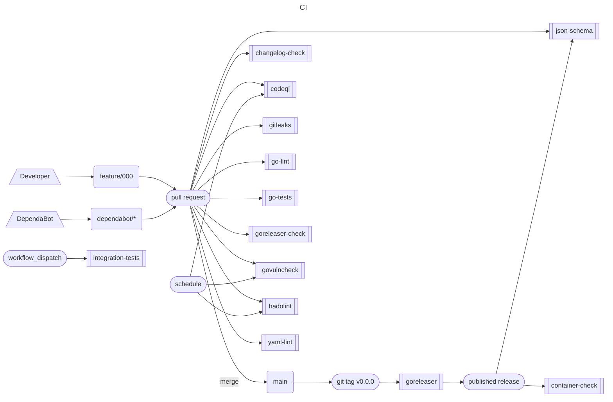

# GitHub Actions for helmtide

Everything here runs on the token GitHub hands the job. Nothing needs a secret
to be configured, and no workflow is left where it can only ever be red.

## What runs when

| Workflow | Trigger | What it does |
| --- | --- | --- |
| `go-tests` | push/PR to main | `go test ./...`, no cluster; coverage as an artifact |
| `go-lint` | push/PR to main | golangci-lint, pinned to v2.4 |
| `govulncheck` | push/PR to main, weekly, manual | fails on any reachable advisory not in `.github/govulncheck-baseline.txt` |
| `codeql` | PR to main, weekly | CodeQL for Go |
| `gitleaks` | push/PR to main, manual | secret scan over the full history |
| `yaml-lint` | push/PR to main, manual | yamllint over the repository, actionlint over these files |
| `hadolint` | PR touching the Dockerfile, weekly | Dockerfile lint, reports only |
| `changelog-check` | PR to main | requires a `changie new` entry (dependabot exempt) |
| `goreleaser-check` | PR touching `.goreleaser.yml` | `goreleaser check` |
| `json-schema` | PR touching the schema, release, manual | builds `schema.json` from source, attaches it to the release |
| `goreleaser` | tag `v*.*.*` | builds, publishes the release and the ghcr.io images |
| `container-check` | release, manual | Trivy over the published image |
| `integration-tests` | manual | the `integration` tagged suite against a KinD cluster |



## What the fork removed, and why

These came from upstream and could only ever fail here, so they were deleted
rather than left red:

| Workflow | Needed |
| --- | --- |
| `changelog` | `GH_APP_ID` / `GH_APP_PRIVATE_KEY`, and approving its own PR |
| `dependabot` | the same GitHub App, to open release branches and auto-merge |
| `release-label`, `release-tag` | the same App and the `release/*` branch dance |
| `docs` | a `docs` repository next to this one, and the App to dispatch it |
| `git-mirror` | `GITLAB_TOKEN` for gitlab.com/diamn/helmwave |
| `qodana` | `QODANA_TOKEN`; it was already disabled with `if: false` |
| `gif` | posted dog pictures on merged pull requests |
| `json-schema-manual` | replaced: `json-schema` builds the schema from source |

Dropped from workflows that stayed: Snyk (`SNYK_TOKEN`), Codecov
(`CODECOV_TOKEN`), Docker Hub (`DOCKERHUB_USER` / `DOCKERHUB_TOKEN`), the
Homebrew tap, the NUR repository and the Telegram announcement.

Releases are cut by pushing a `v*.*.*` tag. `changie batch <version> && changie
merge` is now run by hand, because the workflow that did it needed the App.

## Running the checks yourself

```sh
go test ./...                     # what go-tests runs
golangci-lint run                 # what go-lint runs, with v2.4
.github/scripts/govulncheck.sh    # what govulncheck runs, baseline and all
yamllint --strict -c .yamllint.yaml .
actionlint
```
